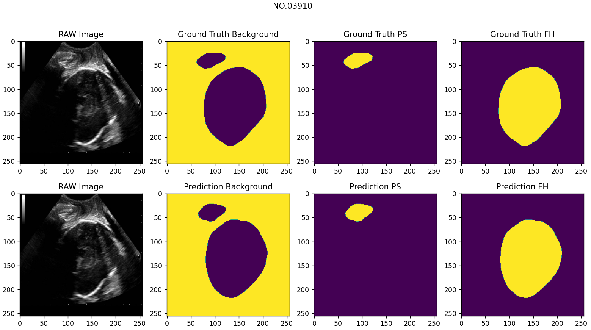

# PSFHS

## Introduction

Implementing Pubic Symphysis-Fetal Head Segmentation (PSFHS) in intrapartum ultrasound images using U-Net. For more detailed task information, please refer to [MICCAI 2023 FH-PS-AOP Challenge](https://ps-fh-aop-2023.grand-challenge.org/). The repository only focuses on pubic symphysis-fetal head segmentation part.

## Dataset

Train dataset URL: https://zenodo.org/records/7851339

Test dataset URL: https://zenodo.org/records/10969427

## Model

The file `./model/unet_mit_b0_717.pt` contains the architecture and weight parameters of the trained model by `train.py`.

## Results

The evaluation results of the above model on the test dataset are as follows.

| **Metric**  | **Value**          |
|:-----------:|:------------------:|
| Sensitivity | 0.9681737953152326 |
| Specificity | 0.9841053025887536 |
| Accuracy    | 0.9787947991986338 |
| IoU         | 0.9389191441051388 |
| F1-score    | 0.9681915143101486 |

The segmentation results of a random example in the test dataset are as follows.

